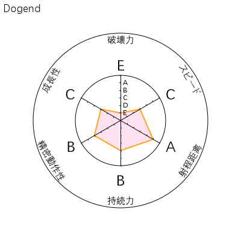

# JOJO替身面板插件

*本README文档由AI生成*

[](https://github.com/Dogend233/astrbot_plugin_jojo_stand_panel)
[](https://github.com/AstrBotDevs/AstrBot)
[](./LICENSE)

一个功能丰富的AstrBot插件，调用TripleYing API生成JOJO风格替身面板图片。支持随机生成、自定义设置、觉醒系统、词库配置等完整功能。

## 📸 效果展示

生成的具有JOJO风格的替身面板，包含替身名称、能力值的雷达图：



*示例：使用插件生成的JOJO替身面板效果图*

## ✨ 功能特性

### 🎲 随机替身系统

- **随机替身**: 生成随机替身面板（带冷却时间）
- **今日替身**: 基于用户ID和日期的固定随机替身
- **冷却机制**: 防止频繁调用，可配置冷却时间

### ⚙️ 替身管理系统

- **设置替身**: 自定义替身名称和6个能力值
- **我的替身**: 查看个人设置的替身面板
- **他的替身**: 通过@用户查看别人的替身
- **数据持久化**: 替身数据永久保存，支持文件+SP混合存储

### ⭐ 觉醒系统

- **觉醒替身**: 随机生成专属替身（初次觉醒）
- **重新觉醒**: 重新生成替身（可配置每日限制）
- **次数统计**: 显示今日剩余觉醒次数
- **智能提示**: 根据配置动态生成提示信息

### 🎨 高级配置

- **可配置词库**: 支持自定义替身名称前后缀（50个默认词汇）
- **群聊白名单**: 精确控制插件使用范围
- **功能开关**: 灵活控制各项功能的启用状态
- **API服务器**: 可自定义API地址

## 📦 安装方法

### 手动安装

```bash
cd AstrBot/data/plugins/
git clone https://github.com/Dogend233/astrbot_plugin_jojo_stand_panel.git
```

## ⚙️ 配置说明

插件支持通过AstrBot WebUI进行可视化配置：

| 配置项                       | 类型 | 说明                             | 默认值                                   |
| ---------------------------- | ---- | -------------------------------- | ---------------------------------------- |
| `api_server`               | 文本 | API服务器地址                    | `https://api.tripleying.com/api/chart` |
| `enable_whitelist`         | 布尔 | 启用群聊白名单                   | `true`                                 |
| `white_list`               | 列表 | 群聊白名单（数字ID）             | `[]`                                   |
| `random_cooldown`          | 整数 | 随机替身冷却时间（秒）           | `300`                                  |
| `enable_set_stand`         | 布尔 | 启用设置替身指令                 | `true`                                 |
| `enable_view_others_stand` | 布尔 | 启用他的替身指令                 | `true`                                 |
| `enable_awaken_system`     | 布尔 | 启用觉醒系统                     | `true`                                 |
| `daily_awaken_limit`       | 整数 | 每日觉醒次数限制（-1为不限次数） | `1`                                    |
| `stand_name_prefixes`      | 文本 | 替身名称前缀词库（逗号分隔）     | 50个默认前缀词汇                         |
| `stand_name_suffixes`      | 文本 | 替身名称后缀词库（逗号分隔）     | 50个默认后缀词汇                         |

### 替身名称词库自定义

在AstrBot WebUI中直接输入逗号分隔的字符串

```
前缀: 白金,黄金,钻石,紫金,银色,光辉,烈焰,寒冰
后缀: 之星,使者,战士,守护,王者,骑士,法师,灵魂
```

默认提供50个前后缀词汇，可组合出2500种不同的替身名称！

## 🎮 指令列表

### 基础指令

| 指令                          | 功能                       | 示例                 |
| ----------------------------- | -------------------------- | -------------------- |
| `/随机替身`                 | 生成随机替身面板（有冷却） | `/随机替身`        |
| `/今日替身`                 | 获取今日固定替身           | `/今日替身`        |
| `/替身面板 <能力值> [名字]` | 创建指定能力值的替身       | `/替身面板 AABCDE` |

### 替身管理

| 指令                          | 功能             | 示例                          |
| ----------------------------- | ---------------- | ----------------------------- |
| `/设置替身 <能力值> [名字]` | 设置个人替身     | `/设置替身 AAAAAA 白金之星` |
| `/我的替身`                 | 查看个人替身面板 | `/我的替身`                 |
| `/他的替身 @用户`           | 查看指定用户替身 | `/他的替身 @张三`           |

### 觉醒系统

| 指令          | 功能         | 限制                 |
| ------------- | ------------ | -------------------- |
| `/觉醒替身` | 首次觉醒替身 | 仅限未觉醒用户       |
| `/重新觉醒` | 重新生成替身 | 配置文件限制每日次数 |

### 能力值格式

能力值必须为**6个连续的字母**（A-E），表示不同等级：

- **A**: 最高等级（5）
- **B**: 高等级（4）
- **C**: 中等级（3）
- **D**: 低等级（2）
- **E**: 最低等级（1）

**6个能力值按顺序代表**：

1. 破坏力
2. 速度
3. 射程距离
4. 持续力
5. 精密动作性
6. 成长性

**有效示例**:

- `AAAAAA` - 全A替身（破坏力:A 速度:A 射程距离:A 持续力:A 精密动作性:A 成长性:A）
- `AABCDE` - 平衡型替身
- `ABCDEE` - 特化型替身

## 🏗️ 项目架构

```
astrbot_plugin_jojo_stand_panel/
├── main.py                      # 插件入口，指令注册
├── _conf_schema.json           # 配置文件模式
├── example.png                 # 替身面板示例图片
├── README.md                   # 项目说明文档（AI生成）
├── metadata.yaml               # 插件元数据和版本信息
├── models/                     # 数据模型层
│   ├── __init__.py
│   └── stand_models.py         # 替身数据结构
├── services/                   # 业务逻辑层
│   ├── __init__.py
│   ├── stand_data_service.py   # 数据服务
│   └── api_service.py          # API服务
├── utils/                      # 工具类层
│   ├── __init__.py
│   ├── config_manager.py       # 配置管理器
│   ├── ability_display_utils.py # 能力值显示工具
│   ├── stand_name_generator.py # 替身名称生成器
│   ├── cooldown_manager.py     # 冷却时间管理器
│   └── service_container.py    # 服务容器（依赖注入）
└── handlers/                   # 指令处理器
    ├── __init__.py
    ├── base_handler.py         # 基础处理器
    ├── random_stand_handler.py # 随机替身处理
    ├── custom_stand_handler.py # 自定义替身处理
    ├── user_stand_handler.py   # 用户替身管理
    └── awaken_stand_handler.py # 觉醒系统处理
```

## 🔗 相关链接

- **AstrBot**: [https://astrbot.app/](https://astrbot.app/)
- **完整版JOJO面板**: [http://www.tripleying.com/jojo](http://www.tripleying.com/jojo)
- **插件仓库**: [https://github.com/Dogend233/astrbot_plugin_jojo_stand_panel](https://github.com/Dogend233/astrbot_plugin_jojo_stand_panel)

## 📝 更新日志

### v2.1.0 (当前版本)

- 🎨 **词库优化**: 默认前后缀词库扩展至50个，支持2500种名称组合
- ⚙️ **配置优化**: 前后缀配置改为WebUI友好的字符串格式（逗号分隔）
- 📊 **显示优化**: 能力值显示统一为"能力名称：能力值"格式
- 📦 **提示美化**: 全面美化提示信息，添加统一图标系统
- ⭐ **觉醒优化**: 动态觉醒次数提示，显示今日剩余次数
- 🛠️ **代码优化**: 清理冗余代码，提高可维护性

### v2.0.1

- 💾 **数据持久化**: 改为插件数据文件夹存储

### v2.0.0

- 🔄 **重构架构**: 模块化重构，提高代码可维护性
- 🛡️ **限制机制**: 添加随机替身冷却时间，防止刷屏滥用
- ⭐ **觉醒系统**: 新增觉醒替身功能，可配置替身名称词库
- 📝 **数据持久化**: 替身系统替身数据持久化存储

## 📄 许可证

本项目使用 [GPL-3.0](./LICENSE) 许可证。
